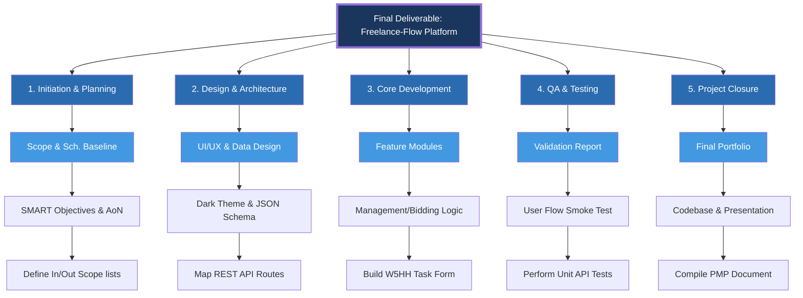

# 📊 Workflow Breakdown Structure (WBS/EBS) - Grid Format
**Project Name:** Freelance-Flow Bidding Platform

This document presents the project structure in the specific grid-based level decomposition format requested.

| WBS Levels | 1. Initiation & Planning | 2. Design & Architecture | 3. Core Development | 4. QA & Testing | 5. Project Closure |
| :--- | :--- | :--- | :--- | :--- | :--- |
| **Final Deliverable (L1)** | **Freelance-Flow Platform** | | | | |
| **Work Streams (L2)** | Project Management | System Architecture | Platform Engineering | Quality Engineering | Deployment & Closure |
| **Deliverables (L3)** | Scope & Schedule Baseline | UI/UX & Data Design | Feature Modules | Validation Report | Final Portfolio (PMP) |
| **Sub-deliverable (L4)** | SMART Objectives & AoN | Dark Theme & JSON Schema | Management/Bidding Logic | User Flow Smoke Test | Codebase & Presentation |
| **Work Packages (L5)** | Define In/Out Scope lists | Map REST API Routes | Build W5HH Task Form | Perform Unit API Tests | Compile PMP Document |

---

### Graphical Format (Mermaid Visualization)
This mimics the flow shown in the grid image.

---

### How to use this for your Project:
1.  **Work Streams**: These are your "Work Streams" (Work Packages as rows).
2.  **Vertical Alignment**: Each column represents one distinct track of the project.
3.  **Depth**: This goes from Level 1 (The whole project) down to Level 5 (The smallest tasks/Work Packages).
