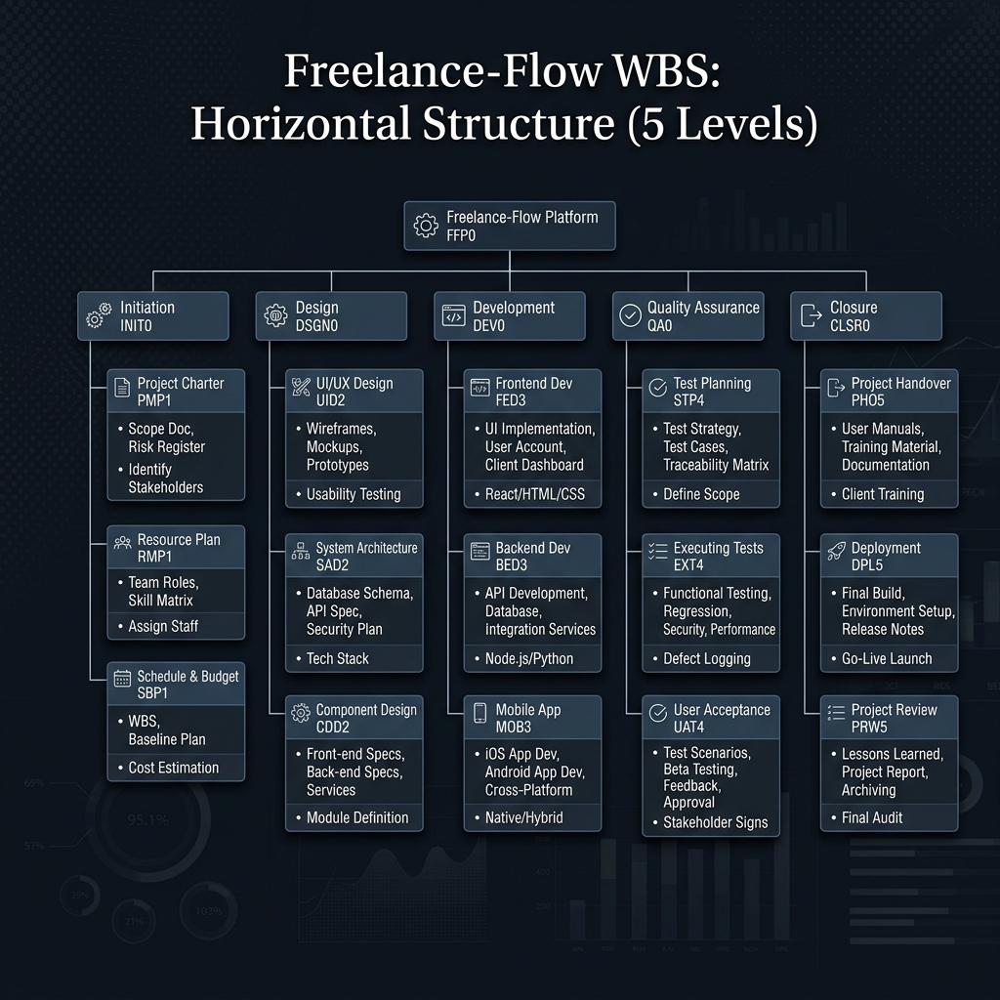
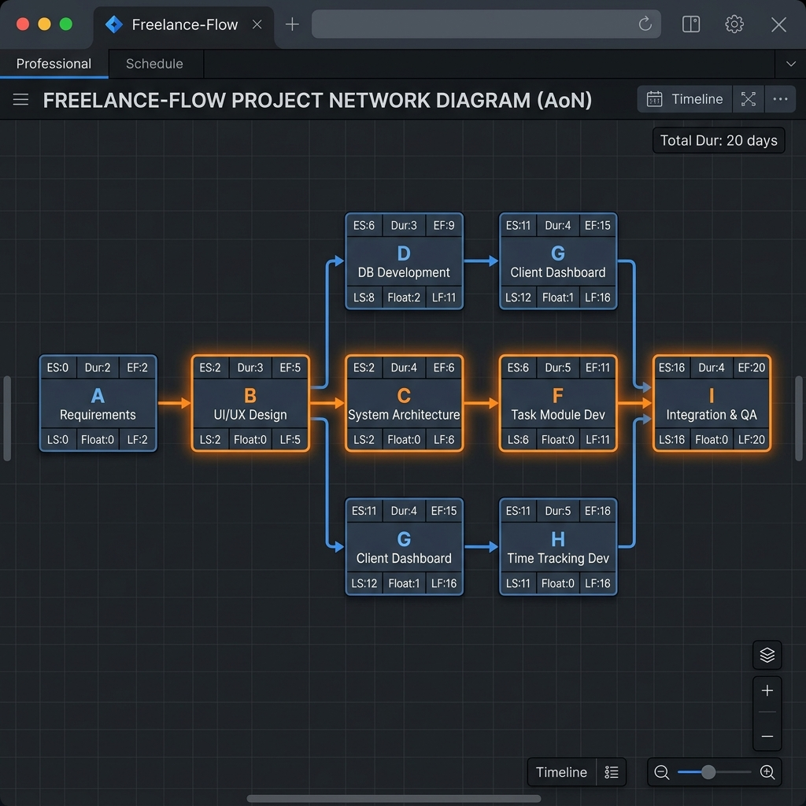
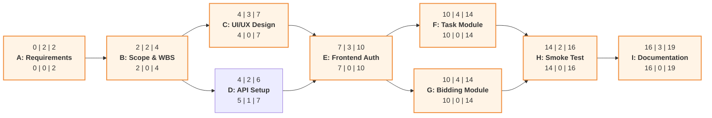

# 🏆 Freelance-Flow: Software Project Management Portfolio
## Final Sprint Challenge Submission

### Phase 1: Scope & Structure

#### 1. Project Scope Statement
**Project Name:** Freelance-Flow
**Description:** A professional bidding platform where clients post software tasks using structured W5HH principles, and developers submit milestone-based bids.

**SMART Objectives:**
- **Specific:** Deliver a functional MVP that allows Clients to post tasks and Developers to bid within a 3-week sprint.
- **Measurable:** Support at least 50 concurrent bids and 15 active tasks with zero data corruption during smoke testing.
- **Achievable:** Utilize React/Express/MongoDB stack to ensure rapid development of core CRUD functionality.
- **Relevant:** Specifically designed to demonstrate WBS, Cost Estimation (COCOMO), and Scope Management.
- **Time-bound:** Completion of all phases and final portfolio submission by Week 13.

**Acceptance Criteria (Technical Delivery Benchmark):**
- System must distinguish between Client and Developer roles upon login.
- Client form must include explicit "In-Scope" and "Out-of-Scope" sections.
- Bids must be broken down into at least one milestone (Phased Bidding).
- System must display an Audit Trail (timestamps) for all bid submissions.

**Constraints:**
- **Fixed Schedule:** Deployment must happen within 21 calendar days.
- **Team Size:** Fixed at 5 members (Distributed workload).
- **Environment:** Must run locally on a modern browser via Vite/Node.

**Explicit Exclusions (Preventing Scope Creep):**
1. **Financial Transactions:** No Stripe/PayPal integration; payments are simulated.
2. **Escrow Logic:** No automated holding or release of funds.
3. **Chat System:** No real-time messaging between users.
4. **Third-party Auth:** No OAuth (Google/GitHub); local JSON/State auth only.

#### 2. Work Breakdown Structure (WBS)
*3-Level Graphical Decomposition*

```mermaid
graph TD
    A[1.0 Freelance-Flow Platform] --> B[1.1 Project Initiation]
    A --> C[1.2 Design & Architecture]
    A --> D[1.3 Core Development]
    A --> E[1.4 Quality Assurance]
    A --> F[1.5 Project Closure]

    B --> B1[1.1.1 Develop Project Charter]
    B --> B2[1.1.2 Define Scope Boundaries]
    B --> B3[1.1.3 Construct Sch. & Budget]

    C --> C1[1.2.1 UI/UX Grid & Themes]
    C --> C2[1.2.2 Backend Schema Design]
    C --> C3[1.2.3 API Route Mapping]

    D --> D1[1.3.1 Auth & RBAC Logic]
    D --> D2[1.3.2 W5HH Task Form]
    D --> D3[1.3.3 Phased Bid Module]
    D --> D4[1.3.4 Audit Trail Module]

    E --> E1[1.4.1 Component Unit Testing]
    E --> E2[1.4.2 User Flow Smoke Test]
    E --> E3[1.4.3 Risk Register Audit]

    F --> F1[1.5.1 Final Portfolio Compilation]
    F --> F2[1.5.2 Prototype Deployment]
    F --> F3[1.5.3 Final Presentation Prep]
```

View WBS Logic (Mermaid)

---

### Phase 2: Time & Cost

#### 1. Activity-on-Node (AoN) Network Diagram (Detailed Block Format)
Each node follows the standard SPM format: **[ES | Dur | EF] / Activity / [LS | Float | LF]**

View AoN Calculation Logic (Mermaid)

**Schedule Calculation Legend:**
- **Top Row:** Early Start (ES) | Duration | Early Finish (EF)
- **Middle Row:** Activity Name
- **Bottom Row:** Late Start (LS) | Total Float | Late Finish (LF)

**Project Schedule Table (AoN Calculations)**

| ID | Task Name | Predecessor | Duration (Days) | ES | EF | LS | LF | Total Float | Critical? |
| :--- | :--- | :--- | :--- | :--- | :--- | :--- | :--- | :--- | :--- |
| **A** | Requirements | None | 2 | 0 | 2 | 0 | 2 | 0 | **Yes** |
| **B** | Scope & WBS | A | 2 | 2 | 4 | 2 | 4 | 0 | **Yes** |
| **C** | UI/UX Design | B | 3 | 4 | 7 | 4 | 7 | 0 | **Yes** |
| **D** | API Setup | B | 2 | 4 | 6 | 5 | 7 | 1 | No |
| **E** | Frontend Auth | C, D | 3 | 7 | 10 | 7 | 10 | 0 | **Yes** |
| **F** | Task Module | E | 4 | 10 | 14 | 10 | 14 | 0 | **Yes** |
| **G** | Bidding Module | E | 4 | 10 | 14 | 10 | 14 | 0 | **Yes*** |
| **H** | Smoke Test | F, G | 2 | 14 | 16 | 14 | 16 | 0 | **Yes** |
| **I** | Documentation | H | 3 | 16 | 19 | 16 | 19 | 0 | **Yes** |

*\*Note: Total Critical Duration: 19 Working Days.*

#### 2. Project Budget (Bottom-Up Estimation)
Labor rates are based on industry standards for a junior-mid dev team of 5.

| WBS Ref | Category | Task Description | Effort (Hrs) | Rate ($/hr) | Total Cost |
| :--- | :--- | :--- | :--- | :--- | :--- |
| 1.1 | PM/Analysts | Requirements & Scope | 40 | 45 | $1,800 |
| 1.2 | Designers | UI/UX & Architecture | 60 | 50 | $3,000 |
| 1.3 | Developers | Build (Auth, Task, Bid) | 160 | 60 | $9,600 |
| 1.4 | QA | Testing & Validation | 30 | 40 | $1,200 |
| 1.5 | Infrastructure | Hosting & Database | - | Flat | $200 |
| | **Subtotal** | Direct Project Costs | | | **$15,800** |
| | **Reserve** | 15% Contingency Reserve | | | **$2,370** |
| | **TOTAL** | **Estimated Budget** | | | **$18,170** |

---

### Phase 3: Risk & Execution

#### Risk Register
Realistic software-specific risks identified for Freelance-Flow.

| ID | Risk Name | Probability (1-5) | Impact (1-5) | Score | Mitigation Plan |
| :--- | :--- | :--- | :--- | :--- | :--- |
| **R1** | **Scope Creep** | 4 | 4 | **16** | Strict adherence to the "Exclusions" list. Weekly scope reviews. |
| **R2** | **Sync Dependency** | 3 | 5 | **15** | Frontend and Backend teams agree on API contracts (JSON schemas) before coding starts. |
| **R3** | **Data Integrity** | 2 | 4 | **8** | Implement nested MongoDB schemas for milestones to prevent bid/task mismatch. |
| **R4** | **Timeline Compression** | 4 | 5 | **20** | Prioritize "Must-Have" features based on WBS. Use existing libraries (Lucide, Framer) for speed. |
| **R5** | **Auth Failure** | 2 | 3 | **6** | Use simple session-based auth initially to ensure smoke testing isn't blocked by login issues. |

---

### Weekly Milestone Schedule (Compliance Check)
- **End of Week 10:** High-level WBS submitted (Matches Section 1.2).
- **End of Week 11:** Schedule Baseline (AoN) and Budget submitted (Matches Section 2.1 & 2.2).
- **End of Week 12:** Risk Audit (Section 3.1) and Prototype Smoke Test completed.
- **Week 13:** Final Submission & Presentation.

**Functional Prototype Status:** 🟢 **Active & Operational**
The system currently supports:
- ✅ W5HH-Based Task Posting
- ✅ Phased Bidding (Milestones)
- ✅ RBAC (Client vs. Developer Dashboards)
- ✅ Audit Trail (Timestamped Bid History)
